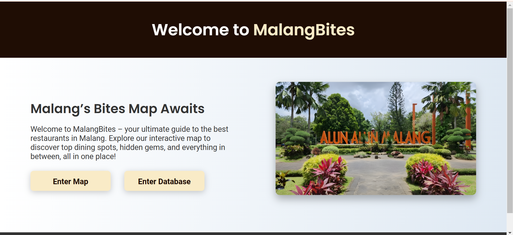
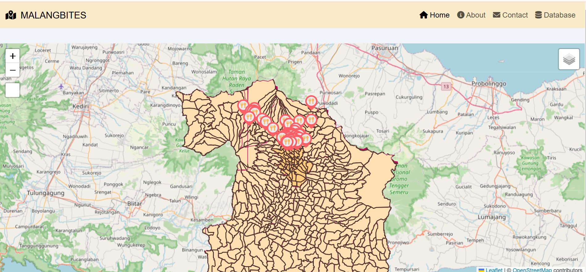
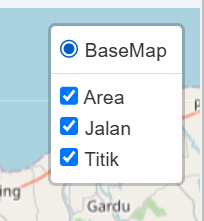
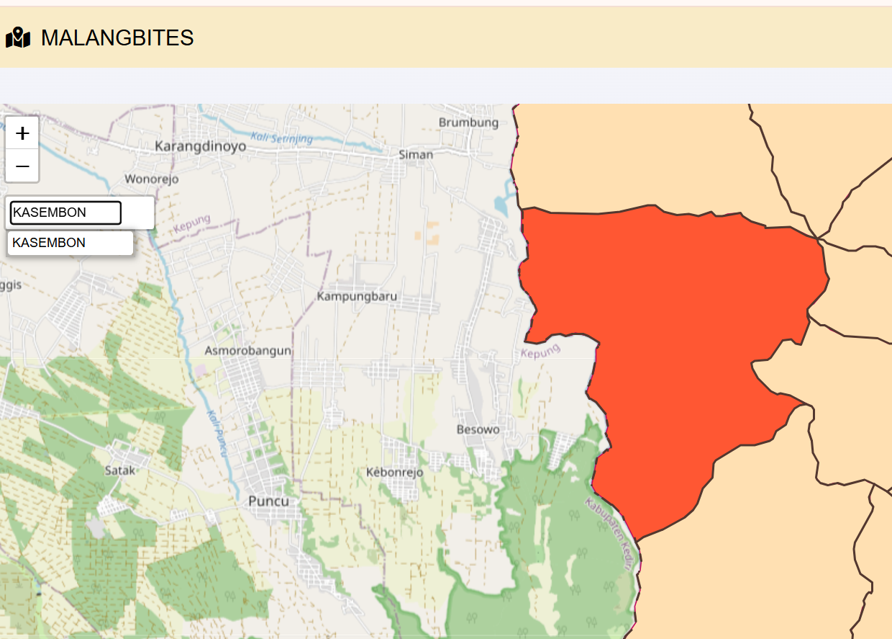
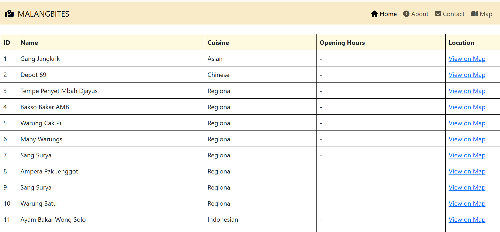
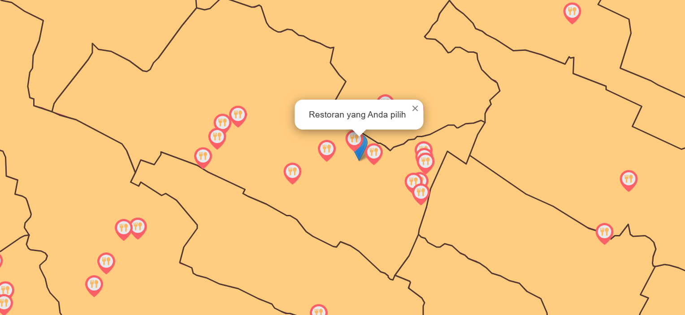

# MALANGBITES
### WebGIS untuk Menampilkan Lokasi Rumah Makan di Kota Malang

---

## Deskripsi Produk
### MALANGBITES adalah platform WebGIS yang dirancang untuk memetakan persebaran rumah makan di Kota Malang. Dengan fitur utama berupa peta interaktif, pengguna dapat dengan mudah menemukan lokasi rumah makan favorit mereka. Selain itu, MALANGBITES menyediakan database informasi rumah makan, mencakup nama, alamat, jenis makanan, dan jam buka yang dapat diakses secara cepat dan akurat.

---

## Komponen Pembangun Produk
Produk ini dibangun menggunakan :

- **Frontend**  
  - **HTML**  
    - `index.html` → Halaman landing page utama sebagai gerbang utama bagi pengguna sebelum masuk ke webgis.  
    - `webgis.html` → Halaman yang menampilkan peta interaktif untuk menampilkan lokasi rumah makan di Malang.  
    - `database.html` → Halaman yang menampilkan informasi restoran dari database.  
  - **CSS**  
    - `style.css` → Mengatur tampilan antarmuka agar lebih menarik, responsif, dan mudah digunakan.

- **Backend**  
  - **PHP**  
    - `connect.php` → Menghubungkan aplikasi dengan database MySQL melalui phpMyAdmin.  
    - `fetch_data.php` → Mengambil data dari database untuk ditampilkan di halaman database.

- **Database**  
  - **MySQL**  
    - Digunakan untuk menyimpan informasi restoran, termasuk nama, lokasi, jenis makanan, dan jam buka. Dikelola menggunakan **phpMyAdmin**.

- **DEsain**  
  - **Bootstrap**  
    - Digunakan untuk membuat desain antarmuka web yang responsif dan menarik, seperi navbar dan modal.
  - **Font Awesome**
    - Digunakan untuk menampilkan ikon pada UI untuk mempercantik halaman.

- **Peta Interaktif**  
  - **LeafletJS** digunakan untuk menampilkan dan mengelola peta interaktif di halaman `webgis.html`.

- **Server**  
  - Server lokal seperti **XAMPP** digunakan untuk menjalankan file PHP dan mengelola database MySQL.

- **Tools Pendukung**  
  - **phpMyAdmin**: Platform yang digunakan untuk membuat dan mengelola database MySQL.  
  - **GitHub**: Platform untuk menyimpan dan membagikan kode sumber proyek.

---

## Sumber Data
- **LAPAKGIS**: digunakan untuk memperoleh data Kota Malang, Kab. Malang, dan Kota Batu.
- **WEBSITE MALANG**: digunakan untuk memperoleh foto.
- **WEB FLATICON**: digunakan untuk memperoleh ikon untuk marker.
- **SCRAPPING**: untuk memperoleh data titik restoran.

---

## Tangkapan Layar
- **Landing Page**
  
- **Map Page**
  
  
  
- **Database Page**
  
  
